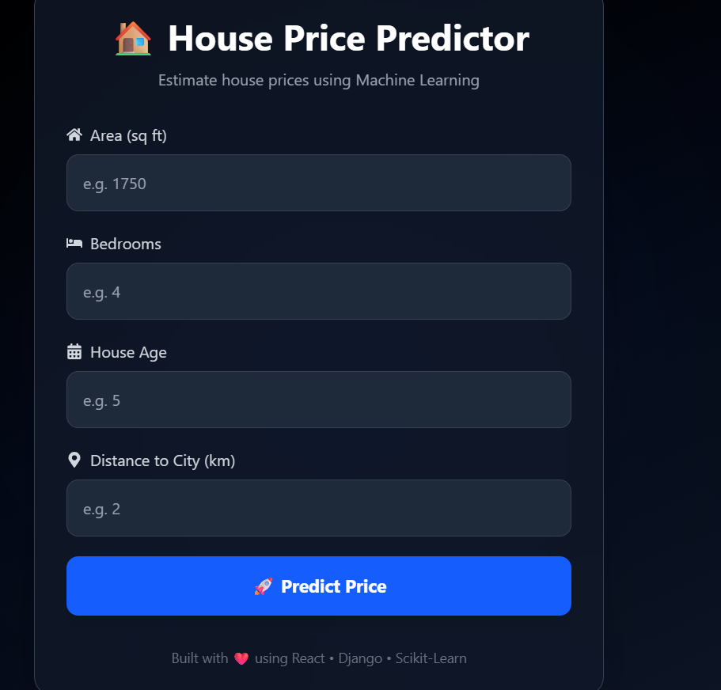
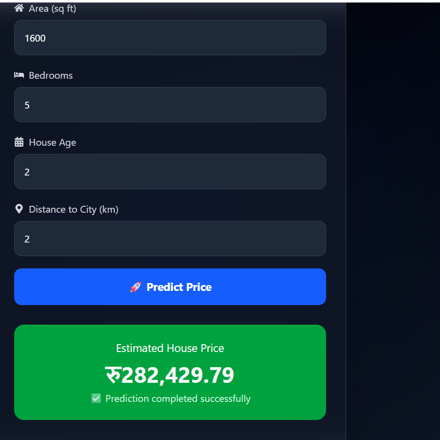

#  House Price Prediction System

A full-stack Machine Learning web application that predicts house prices based on house features using Linear Regression. The project combines a **React + Tailwind CSS** frontend, a **Django REST Framework** backend, and a **Scikit-learn** machine learning model.

>  This is my first end-to-end Machine Learning project, where I learned how to train a model, build an API, create a frontend, and connect everything into a working web application.

---

## 📸 Project Preview

> *(Add screenshots here after uploading them.)*

### Home Page



### Prediction Result



---

# ✨ Features

* 🏠 Predict house prices using Machine Learning
* 🤖 Linear Regression model built with Scikit-learn
* ⚡ Django REST Framework API
* 🎨 Modern React + Tailwind CSS interface
* 📡 REST API communication using JSON
* 💾 Trained model saved using Joblib
* 🌙 Responsive dark-themed UI

---

# 🛠️ Tech Stack

### Frontend

* React
* Tailwind CSS
* JavaScript

### Backend

* Django
* Django REST Framework

### Machine Learning

* Python
* Pandas
* NumPy
* Scikit-learn
* Joblib

---

# 📂 Project Structure

```text
House-Price-Prediction-System/
│
├── backend/
│   ├── config/
│   ├── predictor/
│   ├── house_price_model.pkl
│   ├── manage.py
│   └── requirements.txt
│
├── frontend/
│   ├── src/
│   ├── public/
│   └── package.json
│
└── README.md
```

---

# ⚙️ How It Works

1. The user enters:

   * Area
   * Bedrooms
   * Age
   * Distance to City

2. The React frontend sends the data to the Django REST API.

3. Django loads the trained Machine Learning model.

4. The model predicts the estimated house price.

5. The predicted price is returned to the frontend and displayed to the user.

---

# 🚀 Getting Started

## 1. Clone the Repository

```bash
git clone https://github.com/YOUR_USERNAME/house-price-prediction-system.git
```

```bash
cd house-price-prediction-system
```

---

## 2. Backend Setup

```bash
cd backend
```

Create a virtual environment:

```bash
python -m venv venv
```

Activate it.

### Windows

```bash
venv\Scripts\activate
```

### macOS/Linux

```bash
source venv/bin/activate
```

Install dependencies:

```bash
pip install -r requirements.txt
```

Run the server:

```bash
python manage.py runserver
```

Backend:

```
http://127.0.0.1:8000/
```

---

## 3. Frontend Setup

Open another terminal.

```bash
cd frontend
```

Install packages:

```bash
npm install
```

Start the development server:

```bash
npm run dev
```

Frontend:

```
http://localhost:5173
```

---

# 📡 API Endpoint

### POST

```
/api/predict/
```

### Request

```json
{
  "Area": 1750,
  "Bedrooms": 5,
  "Age": 2,
  "Distance_to_City": 1
}
```

### Response

```json
{
  "predicted_price": 317084.36
}
```

---

# 📚 What I Learned

Through this project I learned:

* Data preprocessing
* Exploratory Data Analysis (EDA)
* Linear Regression
* Model evaluation (MAE, MSE, RMSE, R²)
* Saving ML models using Joblib
* Building REST APIs with Django
* Connecting React with Django
* Full-stack Machine Learning workflow
* Git and GitHub project management

---

# 🔮 Future Improvements

* Use a larger real-world dataset
* Improve model accuracy
* Add feature scaling and preprocessing pipelines
* Try multiple regression algorithms
* Deploy the application online
* Add charts and prediction history
* Improve UI/UX

---

# 👨‍💻 Author

**Prakash Badaila**

Aspiring Machine Learning Engineer | Data Science Enthusiast | Computer Engineering Student

I enjoy building real-world Machine Learning applications and continuously learning new technologies.

---

⭐ If you found this project interesting, consider giving it a star!
